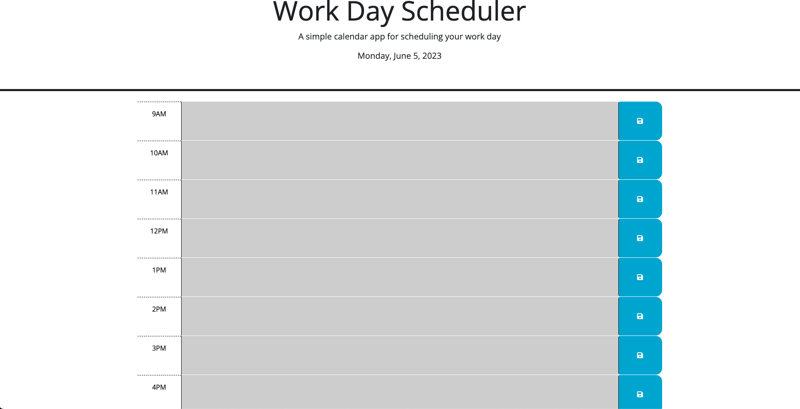
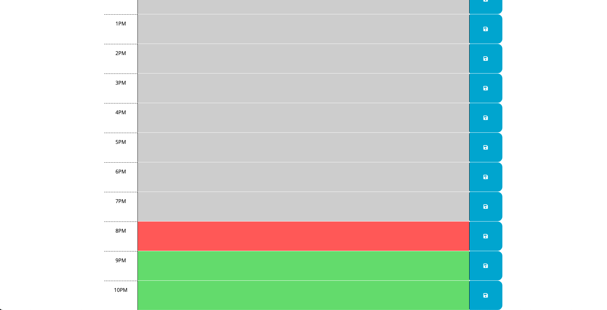

# Work Day Scheduler

## Project Description
Anyone can use this Work Day Scheduler to plan their day. The user can type their event into any open timeslot and when the save button in clicked the user's text is saved to localStorage. The timeslots are also color coded green for future events, red for current events, and gray for past events.

## Images of the Project:

## Link To Live Site:
https://liam04290.github.io/Work-Day-Scheduler/
